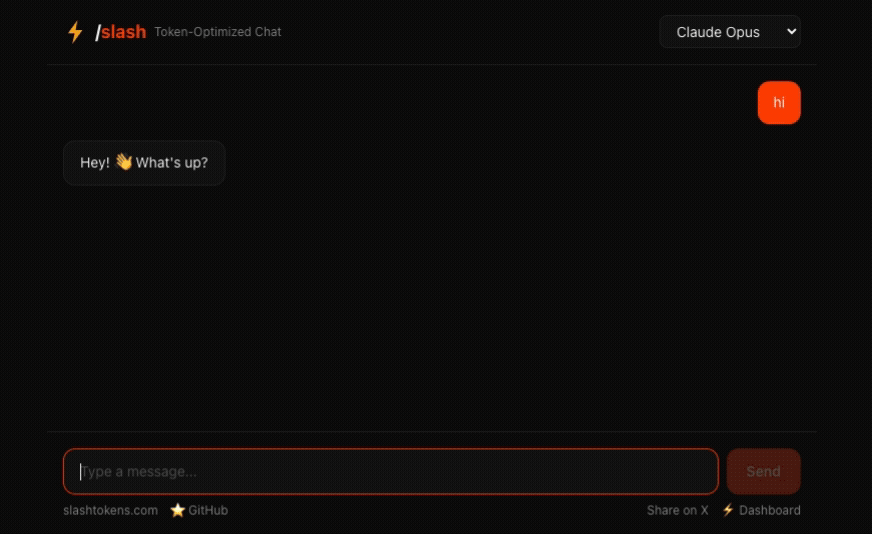

# slash-nextjs — Token-Optimized AI Starter

[](https://github.com/Wolfe-Jam/slash-nextjs/actions/workflows/test.yml)
[](https://vercel.com/new/clone?repository-url=https://github.com/Wolfe-Jam/slash-nextjs&project-name=slash-nextjs&repository-name=slash-nextjs&env=ANTHROPIC_API_KEY&envDescription=Any+one+provider+key+works+-+Anthropic,+OpenAI,+xAI+or+Google.+See+.env.example+for+all+options.&envLink=https://github.com/Wolfe-Jam/slash-nextjs/blob/main/.env.example)
[](https://github.com/Wolfe-Jam/slash-nextjs)

> 💡 **Forking this template?** Your deploy will show the generic green+gold placeholder ("Token Saver") by default — safe out of the box. Edit `app.config.ts` → `brandDefault` with your own brand (name, tagline, colors, logo), then deploy. Slash's identity is gated behind an env var only Slash controls — see [License](#license) for the full brand / code split.

**A Next.js 15 AI starter with pre-flight token optimization baked in.** Every LLM call flows through the Slash Gate before it leaves the server — **Prevent · Re-route · Pass** — so you stop burning money on Claude Opus when Haiku can answer in 5 words.

One proxy. One config line. Three outcomes:

- **Prevent** — empty, duplicate, trivial, context overflow, or rapid-fire calls blocked. $0 spent.
- **Re-route** — cheaper model in the same family fits? Opus 4.7 → Haiku. GPT-5.4 → Nano. Grok-4.20 → Fast. Same answer, 80-95% less.
- **Pass** — right model, right cost? Let it fly.

4.8 KB WASM · sub-millisecond decision · zero added dependencies.

<p align="center">
  
</p>

## Why

Most Next.js AI apps default to a frontier model for everything. A simple query on Opus 4.7 can cost 5–10x more than on Haiku — for the same answer. Slash decides pre-call, not after the invoice.

**Real numbers, not projections.** One user, one day, one dashboard:

> **$477 saved · $47 earned · $430 kept · 3,451 transactions**
> Same day. [10:1 aligned.](https://faf.one/blog/slash-tokens-10-1)

Don't go to the corner shop in a Ferrari.

## Quick Start

```bash
git clone https://github.com/Wolfe-Jam/slash-nextjs.git
cd slash-nextjs
npm install
cp .env.example .env.local   # add at least one provider key
npm run dev
```

Open [http://localhost:3000](http://localhost:3000). When Slash re-routes a call, a chip appears under the response:

```
⚡ routed claude-opus → claude-haiku · saved $0.04
```

Running session total lives in the header.

## Rebrand in 2 minutes

This template ships with placeholder branding ("Token Saver" + green/gold coin). To make it yours:

1. Open `app.config.ts`
2. Change `brand.name`, `brand.tagline`, and the color tokens
3. (Optional) Drop a logo into `public/brand/` and set `brand.logo`
4. Commit, deploy

That's it. No hunt-and-replace across components. The splash, theme tokens, dashboard CTAs, and OG tags all read from that one file.

## Providers

All four frontier providers, all routed through the Gate:

| Provider | Default model | Cheaper options |
|----------|--------------|-----------------|
| Anthropic | Claude Opus 4.7 | Sonnet 4.6, Haiku 4.5 |
| OpenAI | GPT-5.4 | Mini, Nano |
| xAI | Grok-4.20 | Grok-4.1 Fast |
| Google | Gemini 3.1 Pro | Gemini 2.5 Flash |

Set one of `ANTHROPIC_API_KEY`, `OPENAI_API_KEY`, `XAI_API_KEY`, or `GOOGLE_GENERATIVE_AI_API_KEY` in `.env.local`. All four in parallel works too.

## Optional: Savings Dashboard

Track your re-routing + prevention across all your apps at [mcpaas.live/slash/dashboard](https://mcpaas.live/slash/dashboard).

Free key ($5 credit) at [mcpaas.live/slash/setup](https://mcpaas.live/slash/setup). Drop it into `.env.local`:

```
SLASH_KEY=mcp_slash_...
```

Not using the dashboard? Set `dashboard.enabled = false` in `app.config.ts` to hide the CTAs.

## Architecture

- **Next.js 15** App Router + Vercel AI SDK 4
- **Server route** (`app/api/chat/route.ts`) handles all LLM calls — keys never leak to the client
- **Slash proxy** (`lib/models.ts`) wires every provider through `mcpaas.live/slash/v1` for pre-flight checks
- **`slash-tokens`** SDK runs server-side for the routing prediction that powers the chip
- **Splash + BrandMark + theme tokens** all driven by `app.config.ts`

For client-side direct LLM calls (not used in this template), add `import 'slash-tokens/auto'` to `app/layout.tsx` — it patches `fetch()` so every call in the browser goes through the Gate too.

## Deploy

[](https://vercel.com/new/clone?repository-url=https://github.com/Wolfe-Jam/slash-nextjs&project-name=slash-nextjs&repository-name=slash-nextjs&env=ANTHROPIC_API_KEY&envDescription=Any+one+provider+key+works+-+Anthropic,+OpenAI,+xAI+or+Google.+See+.env.example+for+all+options.&envLink=https://github.com/Wolfe-Jam/slash-nextjs/blob/main/.env.example)

The only required env var is one provider key. Everything else has a default in `app.config.ts`.

## Links

- **Live demo:** [slash-tokens.vercel.app](https://slash-tokens.vercel.app)
- **Slash SDK:** [slash-tokens](https://www.npmjs.com/package/slash-tokens) on npm · [GitHub](https://github.com/Wolfe-Jam/slash-tokens)
- **Docs:** [slashtokens.com](https://slashtokens.com) · [FAQ](https://slashtokens.com/faq)

## License

**Code: MIT.** Fork it, ship it, change it, sell it.

**Brand: reserved.** The Slash name, ⚡ mark, and red/gold colors stay with the project. When you deploy a fork, change the name, tagline, and colors in `app.config.ts` first — the default placeholder ("Token Saver", green + gold) is there so you ship safely out of the box.

---

**Slash is step one. FAF's persistent context is the next multiplier →** [faf.one](https://faf.one)

From the team behind the [IANA-registered AI context format](https://www.iana.org/assignments/media-types/application/vnd.faf+yaml).
